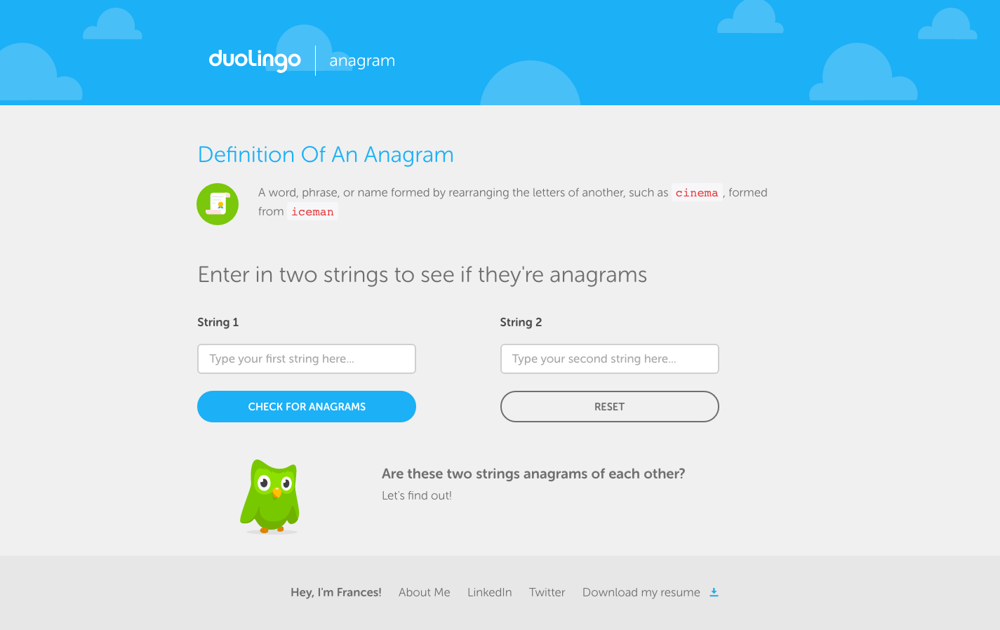

# Duo Anagram

> Check this out at [`fvcproductions.github.io/anagram`](http://fvcproductions.github.io/anagram)

## What is the definition of an anagram?

a word, phrase, or name formed by rearranging the letters of another, such as cinema, formed from iceman

## Task

Create a web page that lets a user input two strings and then tells the user whether the two strings are anagrams of each other.

## Contributing

> To get started...

- 🍴 Fork this repo [here](https://github.com/fvcproductions/anagram#fork-destination-box)
- 🔨 Hack away
- 😊 Add yourself as a contributor
- 🔧 Make a pull request [here](https://github.com/fvcproductions/anagram/compare)

> Or just create an issue - any little bit of help counts! 😊

- 😯 Create an issue [here](https://github.com/fvcproductions/anagram/issues)!

## Credits

 |
:---:|
[`fvcproductions`](http://fvcproductions.com) |

## License

2016 © [FVCproductions](http://fvcproductions.com)

## Donations

> Feed me... 🍕

